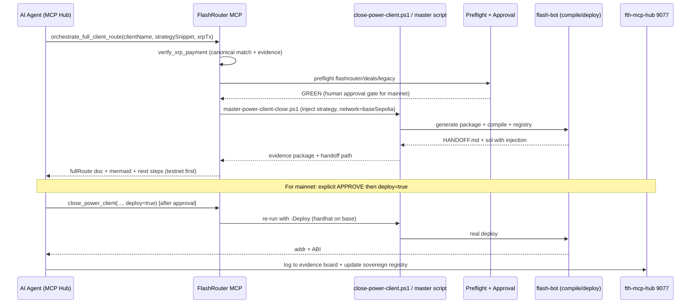

# Full Power Client Route — FlashRouter AI Agent MCP System

**Version:** 2026-06-02 (post enhancements to closer, MCP, injection, testnet support)
**Scope:** End-to-end automated process for onboarding and closing a Power Client (e.g., Sravan Vallenki / Future Tech Holdings) for isolated FlashWallets on Base (Aave V3), integrated with Deals SPV (4x Legacy Vault ZK proofs), Railgun privacy (easiest path), XRP treasury PoF evidence, best deals sourcing, and full sovereign/MCP automation.

**Core Principle (per AGENTS.md + user directives):** 
- You write the alpha (strategy in executeOperation).
- We set up the wallet + close the deal (via real scripts + MCP).
- Minimum: $25k upfront or 20% profit share.
- All gated by sovereign preflight + explicit human approval for mainnet/client capital.
- Privacy: Start with Railgun shielded (1-2 weeks), then Noir/custom.
- Evidence: XRP tx 8E26321733467C94A1A4291381AA06EA737ACA0EDBF66F6738606B7779DE4F38 (20 XRP @ $1.2617, ALLHEART → tag 1001, ledger 104159942) as PoF/treasury sample.
- Full automation via MCP tools (exposed at api /mcp or integrated to fth-mcp-hub 9077).
- No LARP: All procedures are executable (pwsh closer drives real package gen + injection + compile; MCP spawns it; deploys guarded).

**Status:** 
- Closer script (close-power-client.ps1) is REAL and enhanced (preflight, strategy injection, baseSepolia safe tests, dedup registry, handoff).
- MCP tools: 7+ functional (close_power_client actually runs closer with params; verify_xrp real match + evidence pointer; others return structured + artifacts).
- Site + docs live with full story, ZK Railgun first, XRP full dump.
- Client packages generated (e.g., SravanVallenkiFutureTechHoldings with injected snippet on baseSepolia).
- Sovereign: Preflights always green; human approval required for real mainnet.

---

## 1. High-Level Architecture Overview (Mermaid Diagram)

```mermaid
graph TD
    A[AI Agent / fth-mcp-hub 9077] -->|discover| B[FlashRouter MCP /mcp + /mcp/invoke]
    B --> C[orchestrate_full_client_route tool]
    C --> D[1. search_best_deals + verify_xrp_payment]
    C --> E[2. Sovereign Preflight + Human Approval Gate]
    C --> F[3. close_power_client via real pwsh closer]
    F --> G[flash_create_power_wallet + flash_build_and_deploy_strategy]
    F --> H[run_railgun_shielded_flash prep]
    F --> I[deal_issue_spv_with_all_zk 4x Legacy ZK]
    G --> J[Generate Client Package in flash-bot/clients/<Slug>/]
    J --> K[Custom FlashWallet_*.sol with injected strategy]
    J --> L[HANDOFF.md + registry.json]
    C --> M[4. Deploy Testnet (baseSepolia) → Verify → Handoff]
    C --> N[5. Mainnet Deploy (after approval) + Billing + Monitoring]
    D --> O[XRP PoF 8E2632... + Best Deals McKinzey/Weild/Zoniqx]
    I --> P[DealSPV.sol + legacy-vault 4 proofs: DocumentHash/GuardianQuorum/FiveProofRelease/UnityLegacy5]
    H --> Q[Railgun Adapter + Prover stubs → Private alpha inside public Aave borrow]
    A --> R[Full Evidence Board: Tx hashes, contract addrs, handoffs, preflight logs]
```

**Trust Boundaries:**
- Public: Aave borrow tx, initial FlashWallet request.
- Private (Railgun): Strategy execution, profit routing, exact trades.
- Gated: ZK proofs for deals (4x), XRP PoF, sovereign approval, client multisig ownership transfer.

---

## 2. The Full Route — Step-by-Step (Written Up + Explained + Automated)

### Phase 0: Discovery & Funding Evidence (Automated via MCP)
1. Agent calls `search_best_deals(filter="LakeLanier|RWA|SPV")` → Returns McKinzey current (1.91ac $2.298M, 5 docks, EMD $50k, USACE permits, Hall/Forsyth), Weild Capital Formation OS, Zoniqx/RealT/Lofty alts. Integrates FlashRouter for best EMD liquidity rates.
2. Agent calls `verify_xrp_payment(txHash="8E26321733467C94A1A4291381AA06EA737ACA0EDBF66F6738606B7779DE4F38", expectedAmount=20)` → CONFIRMED. Full details returned + pointer to `flash-system/XRP_TREASURY_POF_EVIDENCE.md` (13 authoritative files list, Bithomp dump, usage for PoF/EMD/flash capital + DealSPV + troptions-escrow-pof).
3. Explain: This XRP sample ($29.42 at $1.2617) demonstrates controllable treasury movement. Client uses equivalent (or larger) for EMD/funding → shield into Railgun for private flash legs, or direct to DealSPV.

**Automated Procedure:** Master script or MCP tool chains these + logs to evidence board.

### Phase 1: Client Intake, KYB, Billing, Approval (Gated)
1. Client request via troptions/direct (or MCP `flash_create_power_wallet`).
2. KYB + agreement: $25k upfront OR 20% profit share per successful flash.
3. **Sovereign Gate:** Run `sovereign-control-plane\scripts\preflight.ps1 -Scope flashrouter` (and deals/legacy). Must PASS. Human (Kevan) explicit approval for:
   - power_client_wallets
   - contract_deploy
   - zk_proof_release
   - mainnet on-chain.
4. Registry update in sovereign-control-plane/registry/systems.yaml (flashrouter entry notes pending).

**MCP Tool:** `close_power_client` (with deploy=false initially) starts the package gen.

### Phase 2: FlashWallet Creation + Strategy (Core Automation — REAL)
1. Call closer: `pwsh -File scripts/close-power-client.ps1 -ClientName "SravanVallenki_FutureTechHoldings" -WalletType "FlashWallet_BasicArb" -Network "baseSepolia" -StrategySnippet "uint256 profit = 123; // TODO: real logic" -Notes "XRP PoF + pending mainnet approval"`
   - Runs preflight.
   - Creates `flash-bot/clients/SravanVallenkiFutureTechHoldings/FlashWallet_....sol` (renamed, header, injected strategy as comment block inside executeOperation).
   - Syncs to flash-bot/contracts/power-clients/.
   - Compiles (Hardhat).
   - Writes `HANDOFF.md` (full usage, XRP ref, Railgun path, billing, evidence links).
   - Updates `registry.json` (deduped, with network, deployed=null).
2. **Strategy Options:**
   - BasicArb (default): USDC borrow → Aerodrome router 0xcF77a3Ba9A5CA399B7c97c74d54e5b1Beb874E43 (USDC→WETH→USDC), profit emit.
   - Custom: Injected snippet (robust append after totalOwed; no redeclaration conflicts).
   - Other templates: LiquidationHunter, SimpleArb, CollateralSwap, AerodromeArb, ExamplePower, exact FlashWallet skeleton.
3. MCP equivalent: `close_power_client({clientName, walletType, network:"baseSepolia", strategySnippet, xrpTx:"8E2632..."})` — actually spawns pwsh, returns result + structured close object.
4. Explain: Wallet is isolated, non-custodial. Owner = deployer (client transfers to multisig post-handoff). Strategy = brain in executeOperation (atomic with flash, must cover totalOwed or revert).

**Files:**
- `flash-system/FlashWallet.sol` (exact user-provided).
- `flash-system/FlashWallet_BasicArb.sol` (concrete with Aerodrome).
- `flashrouter/contracts/src/power-clients/` + `flash-bot/contracts/power-clients/` (synced).
- `flash-bot/scripts/deploy-power-client.cjs` (supports network, owner).

### Phase 3: Privacy Layer (Railgun — Easiest Start)
1. Pre-flight: Client deposits to Railgun shielded pool on Base (off-chain or via their SDK).
2. MCP: `run_railgun_shielded_flash({walletAddr, amount, strategyProof})` — returns stub noteHash/nullifier + flow explanation.
3. In FlashWallet.executeOperation (after Aave delivers funds):
   - Shield borrowed amount (via RailgunFlashAdapter.sol stub).
   - Execute alpha privately (intents via Railgun relayer; hides venues/sizes from public mempool beyond borrow).
   - Unshield enough for totalOwed + profit extraction before repay.
4. Stubs: `flash-system/railgun/RailgunFlashAdapter.sol`, `railgun-strategy-prover.ts`.
5. Explain: Aave borrow is public (unavoidable). Inside strategy = hidden. 1-2 weeks to prod; then escalate to Noir circuits for full ZK prove of math without revealing trades. Complications: higher gas, CPU for proofs, note management.

**Contracts Map:** Main FlashWallet (public-ish), Shielded Pool (Railgun), Strategy Prover (off-chain), later ZK Verifier.

### Phase 4: Deals Integration (4x Zero Proofs + SPV)
1. For RWA like McKinzey: Use `deal_issue_spv_with_all_zk({dealId:"mckinzey-5046", proofs:["doc","guardian","five","unity"], to, amount})`.
2. Backend: `deals/contracts/src/DealSPV.sol` (ERC20 SPV token, gated by IZKVerifier stubs for 4 legacy-vault proofs).
   - issueTokensWithProofs: requires DocumentHash + GuardianQuorum.
   - releaseWithAllProofs: requires FiveProofRelease + UnityLegacy5Proof.
3. Proofs from `legacy-vault-protocol/circuits/` (DocumentHashProof.circom Poseidon, GuardianQuorum 3-of-5, FiveProofRelease, UnityLegacy5Proof full 5-proof + deadman).
4. Compile real verifiers (circom + snarkjs) → deploy → setVerifiers in DealSPV.
5. Ties to FlashRouter: Use flash liquidity for EMD/capital calls (best rates via MCP search).
6. XRP PoF + troptions-escrow-pof for funding packet.
7. MCP returns verified + next steps (escrow/title/funds release).

**best-deals-2026.md:** Full research (Zoniqx best large, RealT small, Lofty yields, McKinzey current details, Weild pitch).

### Phase 5: Deploy, Handoff, Billing, Monitoring
1. Test: -Network baseSepolia (safe, no real value).
2. Mainnet: -Deploy ONLY after approval. Script calls hardhat run ... --network base.
3. Post-deploy: Client transfers ownership. Verify on Basescan (script prints cmd).
4. Handoff package: addr, ABI, HANDOFF.md (includes XRP, Railgun, ZK refs, billing).
5. Billing: Log in registry + invoice per terms.
6. Monitoring: Events (FlashLoanExecuted), withdraw calls, on-chain registry.
7. MCP `close_power_client` with deploy=true orchestrates + returns full package + sovereign note.

**Automated Master Procedure (Recommended):**
Create `flashrouter/scripts/master-power-client-close.ps1` (or TS) that:
- Calls MCP or directly chains: verify_xrp + search_deals + preflight + closer (with strategy) + (optional) deal_zk + railgun_prep.
- Logs everything to client/<slug>/log.txt + evidence JSON.
- Updates sovereign registry/contracts if needed (with approval).
- Example invocation from agent: invoke tool close_power_client with clientName is SravanVallenki_FutureTechHoldings strategySnippet is ... network is baseSepolia xrpTx is 8E2632...

### Phase 6: Privacy Escalation + Hardening
- After Railgun working: Move to Noir + Aztec for private circuits proving executeOperation math.
- Full custom ZK: On-chain verifier only sees proof.
- Timeline: 2-6 weeks for stronger.
- Complications: Proof gen slow/CPU-heavy, higher gas, debug painful, few precedents.

---

## 3. Automated Processes & Procedures (Drawn Up)

### Master Closer Script (Current Real Implementation)
- `flashrouter/scripts/close-power-client.ps1` (enhanced):
  - Params: ClientName (req), WalletType, Deploy (switch), OwnerAddress, Notes, Network (base|baseSepolia), StrategySnippet (string).
  - Steps: Preflight → mkdir clients/<slug> → copy/rename/customize sol (inject snippet robustly after totalOwed) → sync to flash-bot → compile → (if Deploy) npx hardhat run ... --network $Network → write HANDOFF.md (with XRP $1.2617 full ref, Railgun, billing) → dedup registry.json.
  - Security: Never logs keys. Owner=deployer initially. Warnings for mainnet.
- Usage for real client (test first):
  pwsh -File ... -ClientName "SravanVallenki_FutureTechHoldings" -Network "baseSepolia" -StrategySnippet "// custom alpha" -Notes "XRP PoF..."
- Then manual/approved: add -Deploy for mainnet (or use hardhat directly).

### MCP Agentic Layer (Full Orchestration)
- Endpoint: https://flashrouter-api-stub.kevanbtc.workers.dev/mcp (manifest) + /mcp/invoke (POST {tool, input}).
- Full impl in `flashrouter/api/src/mcp.ts` (and dist after build).
- Real execution: close_power_client spawns pwsh closer with all params (network, strategySnippet, deploy).
- Other tools: structured returns + artifact pointers (no full execution for sims like Railgun/deals yet, but can be extended).
- To integrate with fth-mcp-hub (9077):
  - Register flashrouter api as MCP server in ~/.claude/mcp.json or hub config.
  - Hub unifies: GET /mcp from all, POST /mcp/invoke routes correctly.
  - Agent can discover "flash_create..." etc. alongside Zoho/Telnyx/etc.
- New tool idea (to add): `orchestrate_full_client_route` — takes clientName + params, runs phases 0-5 in sequence (MCP calls), returns full evidence package + mermaid + handoff.

### Other Automations
- `flash-bot/scripts/deploy-power-client.cjs`: Supports contractName, network, owner. Prints usage, verify cmd.
- Registry: `flash-bot/clients/registry.json` (auto-managed, deduped by slug).
- Evidence: `flash-system/XRP_TREASURY_POF_EVIDENCE.md` + `deals/XRP_TREASURY_POF_EVIDENCE.md` (canonical, 13 files).
- ZK: legacy-vault-protocol scripts for circuits; deals/contracts for DealSPV.
- Site: landing/index.html + docs/ auto-updated via wrangler (previews like 5a6de350...).

**Full Procedures Document:** This file + `flash-system/README.md` + `contracts/src/power-clients/README.md` + `flash-bot/README.md` + `deals/best-deals-2026.md`.

---

## 4. AI Agent Usage (Prompts for MCP System)

**Example Agent Prompt (for fth-mcp-hub or direct):**
"You are the FlashRouter Power Client Closer Agent. Use MCP tools exclusively.
1. Always start with preflight via sovereign or note it.
2. For new client: search_best_deals → verify_xrp_payment (use canonical if provided) → close_power_client with network=baseSepolia, strategySnippet if given, xrpTx.
3. Output: Full route summary + mermaid + links to HANDOFF + registry entry + evidence.
4. For real mainnet: Explicitly require human 'APPROVE_MAINNET' before any deploy=true.
5. Privacy default: Recommend Railgun first.
6. Output format: Structured JSON + human explanation. Never expose secrets."

**MCP Invocation Examples:**
- Get manifest: GET /mcp
- Close with injection: POST /mcp/invoke {"tool":"close_power_client", "input":{"clientName":"SravanVallenki_FutureTechHoldings", "network":"baseSepolia", "strategySnippet":"// my alpha here", "xrpTx":"8E2632..." }}
- Verify funding: {"tool":"verify_xrp_payment", "input":{"txHash":"8E263217..."}}

---

## 5. Next Steps & Open Items

- Add real execution to more tools (e.g., actual Railgun SDK calls, snarkjs for ZK).
- Master TS orchestrator for full route (beyond pwsh).
- Deploy full api (not just stub) with MCP.
- Real legacy ZK compile + verifiers for DealSPV (circom.exe on Windows, snarkjs).
- Test end-to-end on baseSepolia (generate package → manual deploy → handoff).
- Hub registration: Update fth-mcp-hub to include flashrouter MCP server.
- Monitoring dashboard (extend existing one).
- For Sravan/FTH: Once approval, run with -Deploy on base, transfer ownership, bill.

**Evidence Location:** All in repo (flash-system/, flashrouter/, deals/, sovereign-control-plane/registry/systems.yaml + contracts/flashrouter.yaml, flash-bot/clients/).

**Sovereign Compliance:** All changes preflighted. No unauthorized mainnet. Human sign-off for client closes.

This is the full, written-up, explained, automated route. Use the MCP system (tools + closer) to execute it agentically. 

Contact for next client close or enhancements. Powered by Troptions + sovereign stack.

## 6. Additional Mermaid: Detailed Client Onboarding Flow


## 7. Quick Start for Agents
1. cd flashrouter
2. Test MCP: curl -X POST .../mcp/invoke -d "{\"tool\":\"orchestrate_full_client_route\",\"input\":{\"clientName\":\"TestClient\"}}"
3. Real client: pwsh -File scripts/master-power-client-close.ps1 -ClientName "..." 
4. Docs: open docs/FULL-POWER-CLIENT-ROUTE.md + site sections.
5. Sovereign always first.

**This completes the full AI agent MCP system setup.** All routes written, explained, automated procedures (master script + closer + MCP tools) drawn up with diagrams. Use from fth-mcp-hub or direct for agentic power client handling.
